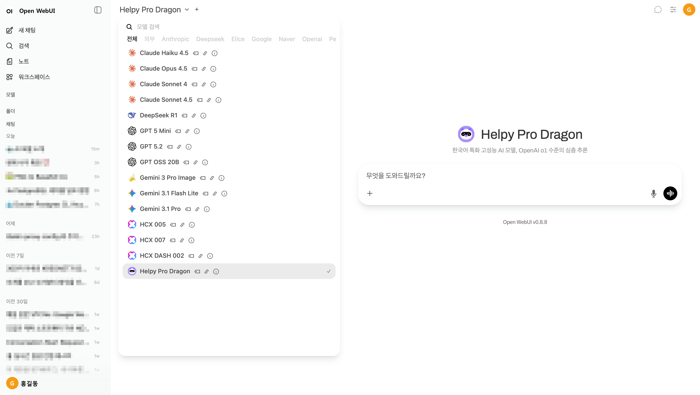

# Open WebUI Chat Hub

`Open WebUI Chat Hub`는 [Open WebUI](https://github.com/open-webui/open-webui)와 [LiteLLM](https://github.com/BerriAI/litellm)을 결합하여 다양한 AI 모델(OpenAI, Claude, Gemini, HyperCLOVA X 등)을 하나의 통합 인터페이스에서 관리하고 사용할 수 있는 LLM 채팅 포털입니다.



## 주요 특징

- **다양한 AI 모델 통합**: OpenAI(GPT), Anthropic(Claude), Google(Gemini), NAVER(HyperCLOVA X), Perplexity, LG(EXAONE) 등 국내외 주요 AI 모델을 하나의 인터페이스에서 사용
- **국내외 API 제공업체 지원**: 엘리스 클라우드, 비즈라우터 등 국내 서버리스 API와 AWS Bedrock, GCP, Azure 등 글로벌 CSP 모두 지원
- **원화 결제 지원**: 국내 LLM API 제공업체 또는 국내 MSP 경유 CSP 사용 시 원화 결제 가능
- **Docker Compose 기반 간편 배포**: 단일 명령(`docker-compose up -d`)으로 Open WebUI, LiteLLM 프록시, PostgreSQL, Prometheus 전체 서비스 실행
- **LiteLLM 파라미터 템플릿**: 빠른 응답 모델(`fast`), 추론 모델(`thinking`), 이미지 생성 모델 등 용도별 타임아웃 및 파라미터 템플릿 제공
- **이미지 생성 모델 지원**: Gemini 이미지 생성 모델 등 텍스트 외 멀티모달 기능 통합
- **Perplexity Citation 처리**: LiteLLM 콜백을 통해 Perplexity 응답의 웹 검색 인용(Citation) 정보를 Open WebUI에서 표시
- **Prometheus 모니터링 내장**: LiteLLM API 사용량 및 성능 메트릭을 Prometheus로 수집하고 365일 보관
- **모델 정보 자동 동기화**: `sync_model_info.py`로 Open WebUI에 표시되는 모델명, 설명, 로고 이미지를 일괄 업데이트
- **AI 에이전트 기반 자동 유지보수**: AI 에이전트가 벤더별 공식 출시 노트를 주기적으로 확인하여 `litellm_config.yml`을 최신 모델 정보로 자동 업데이트

## 지원 API

본 프로젝트는 다음 LLM API를 활용하여 다양한 모델을 연동합니다.

**국내 LLM 서버리스 API**:
- [엘리스 클라우드 API](https://elice.io/ko/cloud/model-library?serverless=true): 엘리스(Helpy), OpenAI(GPT), Antropic(Claude), Google(Gemini), LG(EXAONE) 외 다수
- [비즈라우터 API](https://bizrouter.ai/models): OpenAI(GPT), Antropic(Claude), Google(Gemini), Perplexity, Grok 외 다수

**CSP(Cloud Service Provider) 서버리스 LLM API**:
- [NAVER CLOVA Studio](https://guide.ncloud-docs.com/docs/clovastudio-model): 네이버 고유 모델 (HCX)
- [Google Cloud Platform](https://ai.google.dev/gemini-api/docs/models): Gemini, Nano Banana
- [AWS Bedrock](https://docs.aws.amazon.com/bedrock/latest/userguide/model-ids.html): Amazon 고유 모델, Antropic(Claude) 외 다수
- [Microsoft Azure](https://learn.microsoft.com/ko-kr/azure/foundry/agents/concepts/tool-best-practice#tool-support-by-region-and-model): OpenAI(GPT) 외 다수

> 국내 LLM API 제공업체나 국내 MSP(Managed Service Provider)를 통한 CSP의 LLM API 사용시 원화 결제가 가능합니다.

## 시작하기

### 환경 변수 설정

환경 설정 파일을 생성하고 API 키를 설정합니다:

```bash
cp env.example .env
vi .env
# .env 파일을 편집하여 실제 API 키들을 입력하세요
```

엘리스 클라우드 API 사용시 `litellm_config.yml`의 `api_base`를 엘리스 클라우드 콘솔에서 확인한 URL로 변경합니다.

```yaml
  - model_name: elice-eliceai-helpy-pro-zero
    litellm_params:
      <<: [*elice, *thinking]
      model: openai/eliceai/helpy-pro-zero
      api_base: https://mlapi.run/CHANGE_ME/v1
```

### 서비스 실행

Docker Compose를 사용하여 모든 서비스를 실행합니다:

```bash
docker-compose up -d
```

### 모델 정보 동기화

OpenWebUI 에서 사용자에게 표시될 모델 정보를 업데이트 합니다. 모델의 이름, 대표 이미지, 대표 설명이 업데이트 됩니다. - [참고](docs/sync_model_info.png)

```bash
python3 sync_model_info.py
```

### 서비스 접속

- **Open WebUI**: [http://localhost:8080](http://localhost:8080)
- **LiteLLM 프록시**: [http://localhost:4000](http://localhost:4000)  
- **Prometheus 모니터링**: [http://localhost:9090](http://localhost:9090)

## 주요 파일

| 파일명 | 설명 |
|--------|------|
| `docker-compose.yml` | 전체 서비스 실행 |
| `litellm_config.yml` | LiteLLM 모델 라우팅 및 파라미터 템플릿 설정 |
| `perplexity_citation_callback.py` | LiteLLM용 Perplexity API 응답의 인용(Citation) 처리 - [참고](docs/perplexity_citation_callback.png) |
| `sync_model_info.py` | OpenWebUI에서 표시될 모델 정보 업데이트 - [참고](docs/sync_model_info.png) |
| `MAINTENANCE.md` | AI 에이전트 기반 자동 유지보수 가이드 |

## 유지보수

시스템 유지보수 및 모델 정보 업데이트에 대한 자세한 가이드는 [MAINTENANCE.md](./MAINTENANCE.md)를 참조하세요. 

본 프로젝트는 AI 에이전트가 주기적으로 최신 모델 정보를 자동 확인 및 업데이트할 수 있도록 설계되었습니다.
